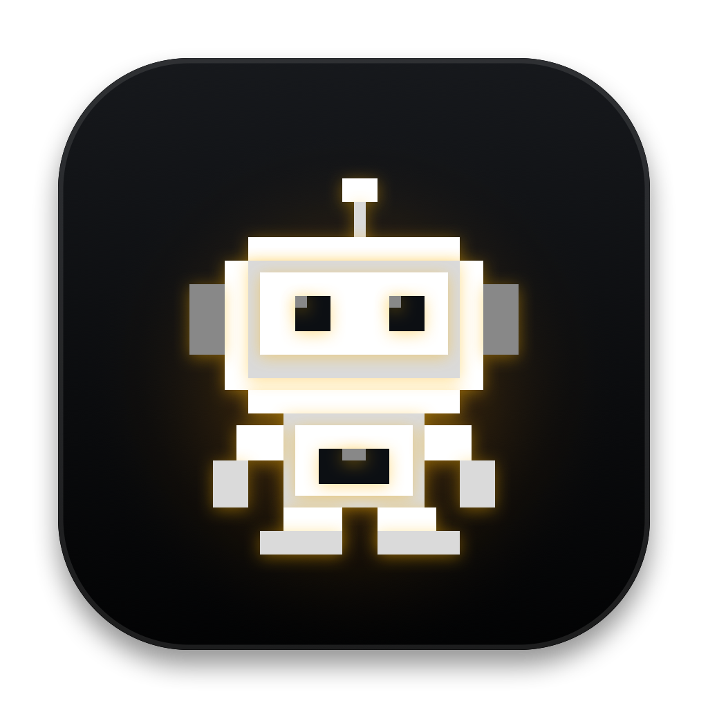

# NotchBot

<p align="center">
  
</p>

NotchBot is a native macOS menu-bar companion for AI coding agents. It extends a MacBook notch with a pixel robot that sleeps with drifting Zs while idle, walks while an agent is working, and jumps with a yellow pulse when an agent needs attention.

Version 0.4.0 supports OpenCode and Claude Code on Apple Silicon Macs running macOS 14 or later.

## Install

Download `NotchBot-0.4.0.dmg` and `NotchBot-0.4.0.dmg.sha256` from the [latest GitHub release](https://github.com/adamdavies/NotchBot/releases/latest), verify the checksum, open the DMG, and move NotchBot into `/Applications`.

```sh
shasum -a 256 -c NotchBot-0.4.0.dmg.sha256
```

Developer ID signing and notarization are preferred. When those credentials are unavailable, an explicitly produced ad-hoc release may require right-clicking NotchBot and selecting **Open**; the release notes identify that status.

Open the fixed robot menu-bar icon and select **Install Integrations** for a first installation. After updating NotchBot, including to v0.4.0, select **Update Integrations** and restart all running OpenCode and Claude Code sessions so they load the current integration.

## Current Features

- Notch-aware, always-on-top AppKit panel across Spaces and full-screen apps
- Automatic, per-display, and all-display placement, including a menu-bar-height synthetic notch for clamshell mode and external displays
- Selectable **Retro Bot**, **Blob Bot**, **Orb Bot**, and **Cat Bot** characters, with Retro Bot as the default
- A fixed robot menu-bar icon that remains consistent when the notch character changes
- Character, display, daily coolness, and opt-in estimated daily spend persistence in `UserDefaults`
- Concurrent session tracking with attention taking priority over working activity
- Live agent count opposite the robot, with a yellow waiting badge
- Click the compact notch panel to focus Terminal, iTerm2, Warp, Ghostty, or Kitty
- Hover shows a redesigned queue of tracked sessions marked Idle, Working, or Needs You, plus daily level progress even when the queue is empty
- Subagents are grouped beneath their parent task and count as active bots; successful subagent completion removes the child without triggering attention
- Permission rows separate the requested scope from bounded native command, path, or resource context and include **Allow Once**, **Always**, and **Decline** controls; Claude's **Always** control appears only for one unambiguous native suggestion
- Clicking an attention row or the compact bot acknowledges its current attention state, stops the Needs You presentation, and focuses the terminal without submitting or hiding any unresolved request
- A duplicate event for an acknowledged request stays quiet, while a new request restores Needs You; after a permission response is submitted, its controls disappear until the provider reports resolution
- Daily coolness tiers at 25, 50, and 100 observed top-level completions add a cumulative cyan isometric glow plate, neon shades, and a gold crown, resetting at local midnight
- Optional local estimated spend tracking for OpenCode and Claude Code, with per-session estimates and a daily total that resets at local midnight
- When no sessions are tracked, idle hover shows an empty queue state instead of retaining completed response text
- Bounded task labels selected from OpenCode session titles or project metadata and Claude Code's existing `session_title`, `agent_type`, or project-directory basename
- Local Unix datagram transport with no telemetry, analytics, or intentional Internet requests
- Explicit global OpenCode and Claude Code integration installation and migration

## Run During Development

```sh
swift run NotchBot
```

Open the menu-bar robot and select **Install Integrations** for a first installation. Select **Update Integrations** after updating the app, then restart all running agent sessions.

Use the **Debug** menu to independently preview robot states and coolness tiers without running an agent. Debug previews remain active until stopped and never change persisted daily progress.

## Manually Test Queue States

With NotchBot running and its integrations installed, set the helper path once in the shell where you will run the commands:

```sh
HOOK="$HOME/Library/Application Support/NotchBot/bin/notchbot-hook"
```

The examples use reserved `notchbot-demo-*` session IDs and do not clear genuine queue entries. Run the cleanup command before switching scenarios if you want to inspect one state at a time.

Show a parent task as **Working**:

```sh
printf '%s\n' '{"session_id":"notchbot-demo-parent","cwd":"/tmp/notchbot-demo","task_label":"Demo parent task"}' \
  | "$HOOK" --source opencode --kind working
```

Show a tracked task as **Idle** by expiring a dummy attention event:

```sh
printf '%s\n' '{"session_id":"notchbot-demo-idle","cwd":"/tmp/notchbot-demo","task_label":"Demo idle task"}' \
  | "$HOOK" --source opencode --kind working
printf '%s\n' '{"session_id":"notchbot-demo-idle","cwd":"/tmp/notchbot-demo","task_label":"Demo idle task"}' \
  | "$HOOK" --source opencode --kind attention --reason "Demo finished" --expires-after 0.1
```

Show a completed parent as persistent **Needs You** attention. It remains in attention until you click the bot or its queue row:

```sh
printf '%s\n' '{"session_id":"notchbot-demo-parent","cwd":"/tmp/notchbot-demo","task_label":"Demo parent task"}' \
  | "$HOOK" --source opencode --kind working
printf '%s\n' '{"session_id":"notchbot-demo-parent","cwd":"/tmp/notchbot-demo","task_label":"Demo parent task"}' \
  | "$HOOK" --source opencode --kind attention --reason "OpenCode finished working"
```

Show a working parent with two indented subagents, one Working and one Needs You:

```sh
printf '%s\n' '{"session_id":"notchbot-demo-parent","cwd":"/tmp/notchbot-demo","task_label":"Demo parent task"}' \
  | "$HOOK" --source opencode --kind working
printf '%s\n' '{"session_id":"notchbot-demo-child-working","parent_session_id":"notchbot-demo-parent","cwd":"/tmp/notchbot-demo","task_label":"Working subagent"}' \
  | "$HOOK" --source opencode --kind working
printf '%s\n' '{"session_id":"notchbot-demo-child-attention","parent_session_id":"notchbot-demo-parent","cwd":"/tmp/notchbot-demo","task_label":"Waiting subagent"}' \
  | "$HOOK" --source opencode --kind attention --reason "OpenCode needs permission"
```

Simulate successful subagent completion. This removes only that child without triggering attention:

```sh
printf '%s\n' '{"session_id":"notchbot-demo-child-working","parent_session_id":"notchbot-demo-parent"}' \
  | "$HOOK" --source opencode --kind cleared
```

Clear every dummy item created by these examples. Clearing the parent also removes any descendants, while the other IDs make cleanup safe if a scenario was run independently:

```sh
for id in \
  notchbot-demo-parent \
  notchbot-demo-child-working \
  notchbot-demo-child-attention \
  notchbot-demo-idle; do
  printf '{"session_id":"%s"}\n' "$id" | "$HOOK" --source opencode --kind cleared
done
```

## Regenerate The Sprite Sheet

The checked-in PNG is generated from integer pixel geometry:

```sh
swift Tools/generate-sprites.swift
```

The output is `Sources/NotchBot/Resources/RobotAtlas.png`, the Retro Bot atlas. It contains six columns and three rows of uniform 48×48 px tiles:

- Row 1: sleeping idle and drifting-Z frames
- Row 2: right-facing walk frames
- Row 3: front-facing jump frames

Regenerate the application icon with:

```sh
swift Tools/generate-app-icon.swift
```

## Test

```sh
swift test
```

## Build An App And DMG

The scripts prefer an installed Developer ID Application identity. An ad-hoc build must be explicitly allowed, and DMG creation requires an explicit notarization choice. Trusted Gatekeeper distribution requires full Xcode, a Developer ID Application certificate, and notarization credentials; an ad-hoc fallback must be clearly labeled in its release notes.

For a local ad-hoc build:

```sh
ALLOW_ADHOC_RELEASE=1 scripts/build-app.sh
NOTARIZE=0 scripts/create-dmg.sh
```

For a Developer ID signed and notarized release:

```sh
SIGNING_IDENTITY="Developer ID Application: Your Name (TEAMID)" scripts/build-app.sh
NOTARIZE=1 NOTARY_PROFILE="notchbot-notary" scripts/create-dmg.sh
```

`SIGNING_IDENTITY` may be omitted when a Developer ID Application identity is installed. The scripts do not silently fall back to ad-hoc signing or silently skip notarization. They verify app and helper signatures, confirm that no entitlements were granted, verify the DMG, and create and check a SHA-256 sidecar. They stop rather than overwrite an existing app, DMG, or checksum.

## Integration Files

NotchBot's v0.4.0 integration and local transport use these paths:

- `~/Library/Application Support/NotchBot/bin/notchbot-hook`
- `~/Library/Application Support/NotchBot/bin/notchbot-hook.notchbot-owner`
- `~/Library/Application Support/NotchBot/bin/notchbot-statusline` (only while cost tracking is enabled)
- `~/Library/Application Support/NotchBot/statusline-state.json` (only while cost tracking is enabled)
- `~/Library/Application Support/NotchBot/integration-installation.json`
- `~/Library/Application Support/NotchBot/integration-backups/claude-settings-<UUID>.backup` (transactional, mode `0600`, normally removed after verification, at most five retained after failures)
- `~/Library/Application Support/NotchBot/event.key`
- `~/Library/Application Support/NotchBot/instance.lock`
- `~/Library/Application Support/NotchBot/notchbot.sock`
- `~/.config/opencode/plugins/notchbot.js`
- `~/.claude/settings.json` (NotchBot handlers are merged into `hooks`; opt-in cost tracking also wraps `statusLine`)

Before changing Claude Code settings, NotchBot creates a mode-`0600` transactional backup under `~/Library/Application Support/NotchBot/integration-backups/`. Managed files are staged in the destination directory with restrictive permissions applied before atomic rename. NotchBot removes a backup after verifying a successful update and retains at most the five newest recognized backups after failures; unrelated files, directories, and symlinks are not pruned. Backups support manual recovery and are not restored automatically. When cost tracking is enabled, NotchBot stores the complete prior status-line configuration, preserves its options and output, and restores it when tracking is disabled. Removal verifies generated markers and managed configuration before deleting files. These checks reduce accidental replacement but cannot protect against a malicious process running as the same user. A legacy `~/.claude/settings.json.notchbot-backup` created by v0.1.0 is left untouched and can be reviewed or removed manually after migration.

Integration revision 17 requires selecting **Update Integrations** after installing the updated app, then restarting all running Claude Code and OpenCode sessions.

## Privacy

NotchBot is local-only by design. It has no telemetry or analytics and makes no intentional Internet requests. OpenCode and Claude Code have their own network behavior, which is outside NotchBot's control.

The integrations send encrypted, authenticated lifecycle events containing source, session identifier, optional parent-session identifier, working-directory path, terminal identifier, reason, expiry, a bounded task label, and optional permission metadata over the local Unix datagram socket at `~/Library/Application Support/NotchBot/notchbot.sock`. When cost tracking is explicitly enabled, events may also contain a provider-reported estimated USD cost and an opaque OpenCode process generation identifier used for deduplication. OpenCode hierarchy comes from its session `parentID`; Claude Code hierarchy comes from its documented `agent_id` and parent `session_id` hook fields. Outside bounded native permission context, NotchBot does not select prompt fields, transcripts, task subjects, task descriptions, assistant response text, or token details. Labels appear in the hover queue and remain in memory. Daily coolness stores a local date and aggregate completion count in `UserDefaults`. Estimated daily spend stores the local date, total, and bounded source-qualified cost baselines needed to process cumulative updates across restarts and midnight; inactive baselines are pruned. NotchBot uses the working-directory path to display a project name and focus a terminal; it does not traverse or read arbitrary project files.

Claude Code supplies its hook JSON, and while cost tracking is enabled its documented status-line JSON, to `notchbot-hook` on standard input. The decoders accept only allowlisted bounded fields and the numeric estimated session cost. Prompt, transcript, response, model, context-window, rate-limit, and token fields can reach the helper process in raw Claude input but are not selected, retained, or forwarded. The helper accepts at most 64 KiB, reading one additional byte only to detect overflow. The OpenCode plugin does not pass through raw events or assistant messages: it constructs an allowlisted payload and, only after opt-in, reads numeric assistant-message cost estimates.

The socket is readable and writable only by the current macOS user. This protects against other local user accounts, not other processes running as the same user: a same-user process can inspect integration files or forge local events. See [SECURITY.md](SECURITY.md) for the full threat model.

NotchBot 0.4.0 is not App Sandbox enabled and requests no signing entitlements.

## License

NotchBot is available under the [MIT License](LICENSE).
